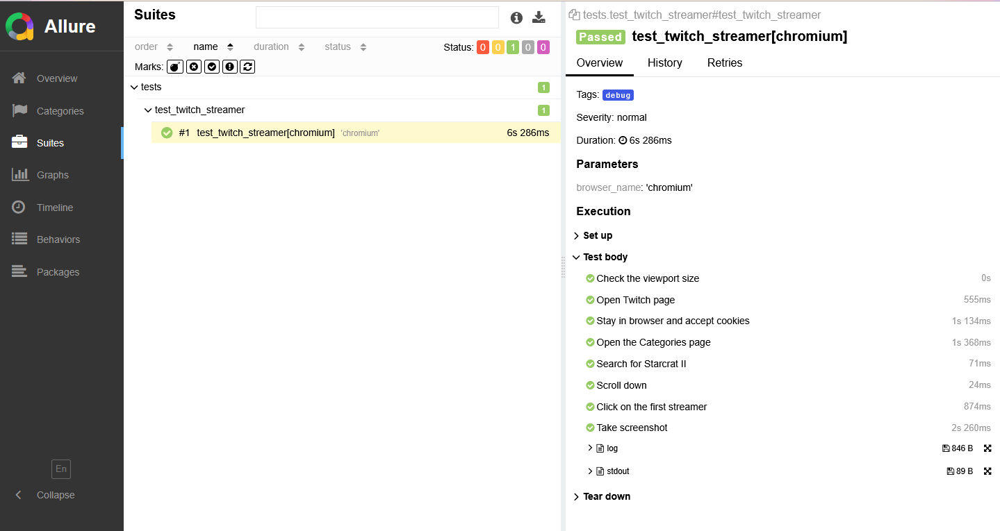

# twitch-web-tests

## Setup

1. Create a virtual environment
2. Install dependencies from requirements.txt
3. Install the playwright browsers:

   `playwright install`

4. Run the test in command line:

   `pytest --headed --alluredir=allure-report`

## Features

- POM structure, one class for each web page
  - Each class will have the actions specific to that page
  - Locators are stored in the class, but they can be moved to a separate file when more tests and pages are added
- Test preconditions should be implemented as fixtures, to allow re-using them when needed
- Logging enabled - both for CLI (debugging) and for captured logs (pipelines)
- Report is generated with Allure

## Test execution GIF

## Allure report screenshot

